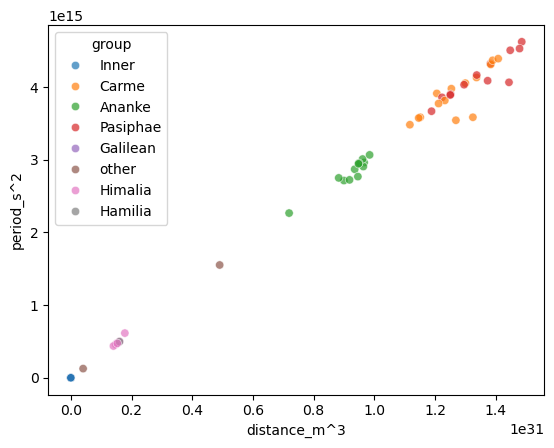
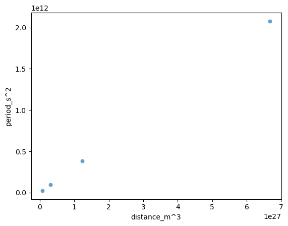

**Table of contents**   
- [Aims](#aims)    
  - [Method](#method)    
    - [Plotting](#plotting)    
  - [Conclusion](#conclusion)    

<!-- vscode-jupyter-toc-config
	numbering=false
	anchor=true
	flat=false
	minLevel=1
	maxLevel=6
	/vscode-jupyter-toc-config -->
<!-- THIS CELL WILL BE REPLACED ON TOC UPDATE. DO NOT WRITE YOUR TEXT IN THIS CELL -->


```python
import pandas as pd
import matplotlib.pyplot as plt
import numpy as np
import seaborn as sns
import scipy.stats as stats
```


```python
database_service = "sqlite"
database = "jupiter.db"
connectable =  f"{database_service}:///{database}" ## Creating a variable to connect to the database

db_contents = pd.read_sql("SELECT * FROM sqlite_master", connectable) ## Creating a variable to contain the details of the database

moons = pd.read_sql("SELECT * FROM moons", connectable) ## Creating a variable to contain the details of the moons table
```


```python
def scat_plot(data, x, y, alpha = 0.7, hue = "group", **kwargs):
    sns.scatterplot(data = data, x = x, y = y, alpha = alpha, hue = hue, **kwargs)
```

## <a id='toc1_1_'></a>[Aims](#toc0_)

For this task, I already have a regression plot of $T^2$ against $a^3$, however, the units used for each axis do not match the units of the gravitational constant (G) which are $m^3 kg^{-1} s^{-2}$.  
To correct this, I will replot the graph, using a conversion of  

$$\text{distance\_m = distance\_km * 1000}$$
$$\text{period\_s = period\_days * 86400}$$

and then find the new gradient of the line of best fit which can be used to find the mass of Jupiter.  

I do not believe that hyperparameters are at all necessary to perform this linear model.  
This is due to the relationship between period and distance being already well-defined by Kepler's Third Law, therefore the function to find the gradient is not having to find a new pattern but simply has to extract a value from the known model.

If hyperparameters were introduced, it would add unnecessary complexity to the program without actually improving the model's accuracy.

## <a id='toc1_2_'></a>[Method](#toc0_)

I have this equation:
$$T^{2} = \frac{4\pi^{2}}{GM}a^{3}$$
from Kepler's Third Law.  
Comparing this to a straight line graph;
$$y = mx + c$$
it is clear that this equation represents a straight line which passes through the origin and has a gradient of $\frac{4\pi^2}{GM}$ when $T^2$ is plot against $a^3$.  
The mass of the object being orbit, in this case Jupiter, is defined by the $M$ value in the denominator of the gradient, and this is the value I wish to calculate for this task.

### <a id='toc1_2_1_'></a>[Plotting](#toc0_)

First I will create new columns in a data frame to hold the converted values of T and a.  
Then I will plot a new graph of $T^2$ against $a^3$ and use np.polyfit() to calculate the new gradient with the correct units of $\frac{s^2}{m^3}$


```python
moons["distance_m^3"] = (moons["distance_km"] * 1000) ** 3 ## New column of distance^3 in metres
moons["period_s^2"] = (moons["period_days"] * 86400) ** 2 ## New column of period^2 in seconds

plt.figure()

scat_plot(
    data = moons,
    x = "distance_m^3",
    y = "period_s^2"
)

gradient, _ = np.polyfit(moons["distance_m^3"], moons["period_s^2"], 1)


```


    

    


Now I have a value for the gradient, I can use 
$$\text{gradient} = \frac{4\pi^2}{GM}$$
and rearrange to get 
$$M = \frac{4\pi^2}{G * gradient}$$
where $G = (6.67 \pm 0.005) * 10^{-11}$


```python
G = 6.67E-11
pi = np.pi
Mass = (4 * (pi ** 2))/(G * gradient)
print(f'The mass of Jupiter calculated from the given data values is {Mass:.2e} kg.')
```

    The mass of Jupiter calculated from the given data values is 1.93e+27 kg.


To check if this value of 1.93e+27 kg is accurate to the accepted value of Jupiter's mass, I will find the number of standard deviations it is from the true value of 1.898e+27


```python
def error_propagation(data, G, gradient, M):
    G_err = 0.005E-11
    gradient_err = stats.linregress(data["distance_m^3"], data["period_s^2"]).stderr
    M_err = M * np.sqrt( (G_err / G) ** 2 + (gradient_err / gradient) ** 2 )
    return M_err


mass_uncertainty = error_propagation(moons, G, gradient, Mass)
mass_uncertainty = float(f'{mass_uncertainty:.1g}')
z_score = (Mass - 1.898e+27) / mass_uncertainty

print(f'The mass of Jupiter has an uncertainty of ±{mass_uncertainty:.2e} kg.')
print(f'The calculated mass is {z_score:.2f} standard deviations away from the accepted value of 1.898e+27 kg.')
```

    The mass of Jupiter has an uncertainty of ±2.00e+25 kg.
    The calculated mass is 1.75 standard deviations away from the accepted value of 1.898e+27 kg.


As the calculated value is 1.75 standard deviations out from the accepted value, it can be classed statistically as accurate, due to it being within a 2 standard deviation range from the true value, therefore there isn't a significant difference.  
Also, the uncertainty in the value is only 1% of the calculated value, so it is accurate to say that this mass value is very acceptable when compared to the true value.

To validate this model, I will calculate the mass using only the Galilean moons as these are the most accurately observed moons of Jupiter, and compare this value to the previous one.


```python
galilean = moons.loc[moons["group"] == "Galilean", ["moon", "distance_m^3", "period_s^2"]]

plt.figure()
scat_plot(
    data = galilean,
    x = "distance_m^3",
    y = "period_s^2",
    hue = None
)

gradient = np.polyfit(galilean["distance_m^3"], galilean["period_s^2"], 1)[0]

plt.show()

M = (4 * (pi ** 2))/(G * gradient)

mass_uncertainty = error_propagation(galilean, G, gradient, M)
mass_uncertainty = float(f'{mass_uncertainty:.1g}')

z_score = (M - 1.898e+27) / mass_uncertainty
print(f'The mass of Jupiter calculated from only the Galilean moons is ({M:.2e} ± {mass_uncertainty:.2e}) kg')
print(f'z_score: {z_score:.2f}')
```


    

    


    The mass of Jupiter calculated from only the Galilean moons is (1.90e+27 ± 1.00e+24) kg
    z_score: 1.44


This mass is closer to the expected value of mass for Jupiter, which is what I expected to observe, due to these moons being more accurately observed than any of the other moon groups.  
However, this value has a larger z-score than the previous one, as the error in the gradient is much lower dues to a more linear trend on the graph. This means that the uncertainty in the mass is only 0.05% of the total value, therefore the result is incredibly precise, which results in the larger z-score.  

It is more acceptable to use the mass value calculated using the whole collection of moons in the jupiter.db file as the mass from both are just estimates and that mass uses a wide range of different types of moons, making it a more realistic observation overall due to the variety of data.

## <a id='toc1_3_'></a>[Conclusion](#toc0_)

Overall, from this use of Kepler's Third Law, I will take the value of mass of Jupiter to be (1.93 ± 0.02)e+27 kg as it is statistically accurate, as well as using a wide range of data points to keep the value as accurate to the model as possible.

$$M = (1.93 \pm 0.02)e+27 \text{ kg}$$
